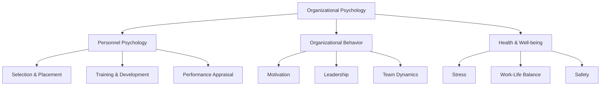

```mermaid
flowchart TD
    OP[Organizational Psychology] --> P[Personnel Psychology]
    OP --> OB[Organizational Behavior]
    OP --> HW[Health & Well-being]

    P --> S[Selection & Placement]
    P --> T[Training & Development]
    P --> PA[Performance Appraisal]

    OB --> M[Motivation]
    OB --> L[Leadership]
    OB --> T2[Team Dynamics]

    HW --> S2[Stress]
    HW --> WLB[Work-Life Balance]
    HW --> S3[Safety]
```
