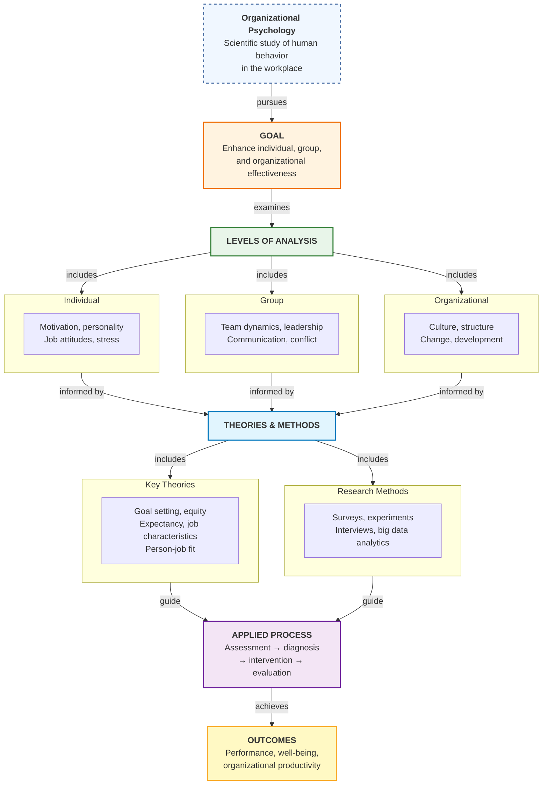

```mermaid
flowchart TD
    A[<b>Organizational Psychology</b><br>Scientific study of human behavior<br>in the workplace]:::title
    B[<b>GOAL</b><br>Enhance individual, group,<br>and organizational effectiveness]:::goal
    C[<b>LEVELS OF ANALYSIS</b>]:::levels
    subgraph D[Individual]
        D1[Motivation, personality<br>Job attitudes, stress]
    end
    subgraph E[Group]
        E1[Team dynamics, leadership<br>Communication, conflict]
    end
    subgraph F[Organizational]
        F1[Culture, structure<br>Change, development]
    end
    G[<b>THEORIES & METHODS</b>]:::theory
    subgraph H[Key Theories]
        H1[Goal setting, equity<br>Expectancy, job characteristics<br>Person-job fit]
    end
    subgraph I[Research Methods]
        I1[Surveys, experiments<br>Interviews, big data analytics]
    end
    J[<b>APPLIED PROCESS</b><br>Assessment → diagnosis<br>→ intervention → evaluation]:::process
    K[<b>OUTCOMES</b><br>Performance, well‑being,<br>organizational productivity]:::outcome

    A -->|pursues| B
    B -->|examines| C
    C -->|includes| D
    C -->|includes| E
    C -->|includes| F
    D & E & F -->|informed by| G
    G -->|includes| H
    G -->|includes| I
    H & I -->|guide| J
    J -->|achieves| K

    classDef title fill:#f0f7ff,stroke:#4a6fa5,stroke-width:2px,color:#333,stroke-dasharray: 5 5
    classDef goal fill:#fff3e0,stroke:#ef6c00,stroke-width:2px,color:#333
    classDef levels fill:#e8f5e9,stroke:#2e7d32,stroke-width:2px,color:#333
    classDef theory fill:#e1f5fe,stroke:#0277bd,stroke-width:2px,color:#333
    classDef process fill:#f3e5f5,stroke:#6a1b9a,stroke-width:2px,color:#333
    classDef outcome fill:#fff9c4,stroke:#f9a825,stroke-width:2px,color:#333
```
