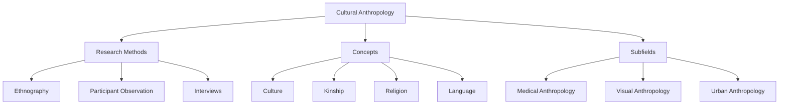

```mermaid
flowchart TD
    CA[Cultural Anthropology] --> RM[Research Methods]
    CA --> C[Concepts]
    CA --> S[Subfields]

    RM --> E[Ethnography]
    RM --> PO[Participant Observation]
    RM --> I[Interviews]

    C --> CUL[Culture]
    C --> K[Kinship]
    C --> R[Religion]
    C --> L[Language]

    S --> MED[Medical Anthropology]
    S --> VIS[Visual Anthropology]
    S --> URB[Urban Anthropology]
```
