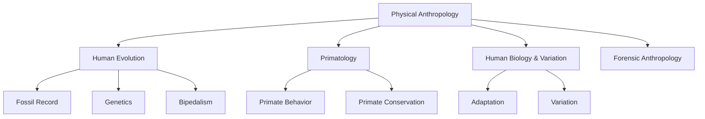

```mermaid
flowchart TD
    PA[Physical Anthropology] --> H[Human Evolution]
    PA --> P[Primatology]
    PA --> B[Human Biology & Variation]
    PA --> F[Forensic Anthropology]

    H --> F2[Fossil Record]
    H --> G[Genetics]
    H --> B2[Bipedalism]

    P --> PB[Primate Behavior]
    P --> PC[Primate Conservation]

    B --> AD[Adaptation]
    B --> V[Variation]
```
