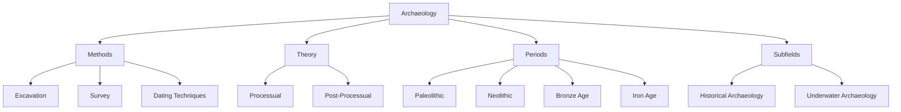

```mermaid
flowchart TD
    A[Archaeology] --> M[Methods]
    A --> T[Theory]
    A --> P[Periods]
    A --> S[Subfields]

    M --> E[Excavation]
    M --> S2[Survey]
    M --> D[Dating Techniques]

    T --> PROC[Processual]
    T --> POST[Post-Processual]

    P --> PAL[Paleolithic]
    P --> NEO[Neolithic]
    P --> BA[Bronze Age]
    P --> IA[Iron Age]

    S --> H2[Historical Archaeology]
    S --> U[Underwater Archaeology]
```
