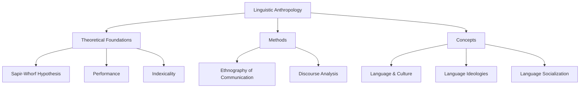

```mermaid
flowchart TD
    LA[Linguistic Anthropology] --> T[Theoretical Foundations]
    LA --> M[Methods]
    LA --> C[Concepts]

    T --> S[Sapir-Whorf Hypothesis]
    T --> P[Performance]
    T --> I[Indexicality]

    M --> E[Ethnography of Communication]
    M --> DA[Discourse Analysis]

    C --> L[Language & Culture]
    C --> LI[Language Ideologies]
    C --> LS[Language Socialization]
```
