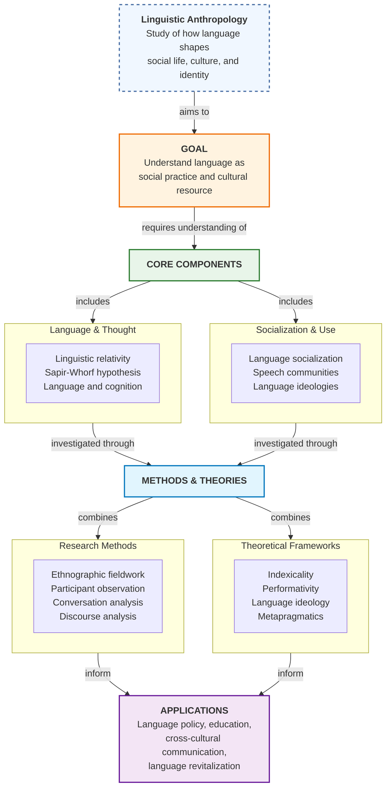

```mermaid
flowchart TD
    A[<b>Linguistic Anthropology</b><br>Study of how language shapes<br>social life, culture, and identity]:::title
    B[<b>GOAL</b><br>Understand language as<br>social practice and cultural resource]:::goal
    C[<b>CORE COMPONENTS</b>]:::components
    subgraph D[Language & Thought]
        D1[Linguistic relativity<br>Sapir-Whorf hypothesis<br>Language and cognition]
    end
    subgraph E[Socialization & Use]
        E1[Language socialization<br>Speech communities<br>Language ideologies]
    end
    F[<b>METHODS & THEORIES</b>]:::methods
    subgraph G[Research Methods]
        G1[Ethnographic fieldwork<br>Participant observation<br>Conversation analysis<br>Discourse analysis]
    end
    subgraph H[Theoretical Frameworks]
        H1[Indexicality<br>Performativity<br>Language ideology<br>Metapragmatics]
    end
    I[<b>APPLICATIONS</b><br>Language policy, education,<br>cross‑cultural communication,<br>language revitalization]:::outcome

    A -->|aims to| B
    B -->|requires understanding of| C
    C -->|includes| D
    C -->|includes| E
    D & E -->|investigated through| F
    F -->|combines| G
    F -->|combines| H
    G & H -->|inform| I

    classDef title fill:#f0f7ff,stroke:#4a6fa5,stroke-width:2px,color:#333,stroke-dasharray: 5 5
    classDef goal fill:#fff3e0,stroke:#ef6c00,stroke-width:2px,color:#333
    classDef components fill:#e8f5e9,stroke:#2e7d32,stroke-width:2px,color:#333
    classDef methods fill:#e1f5fe,stroke:#0277bd,stroke-width:2px,color:#333
    classDef outcome fill:#f3e5f5,stroke:#6a1b9a,stroke-width:2px,color:#333
```
