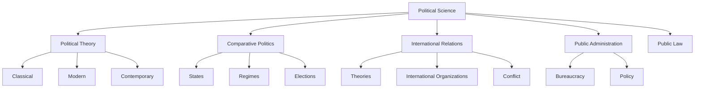

```mermaid
flowchart TD
    PS[Political Science] --> PT[Political Theory]
    PS --> CP[Comparative Politics]
    PS --> IR[International Relations]
    PS --> PA[Public Administration]
    PS --> PL[Public Law]

    PT --> CL[Classical]
    PT --> MOD[Modern]
    PT --> CONT[Contemporary]

    CP --> S[States]
    CP --> R[Regimes]
    CP --> E[Elections]

    IR --> T[Theories]
    IR --> IO[International Organizations]
    IR --> C2[Conflict]

    PA --> B[Bureaucracy]
    PA --> P[Policy]
```
