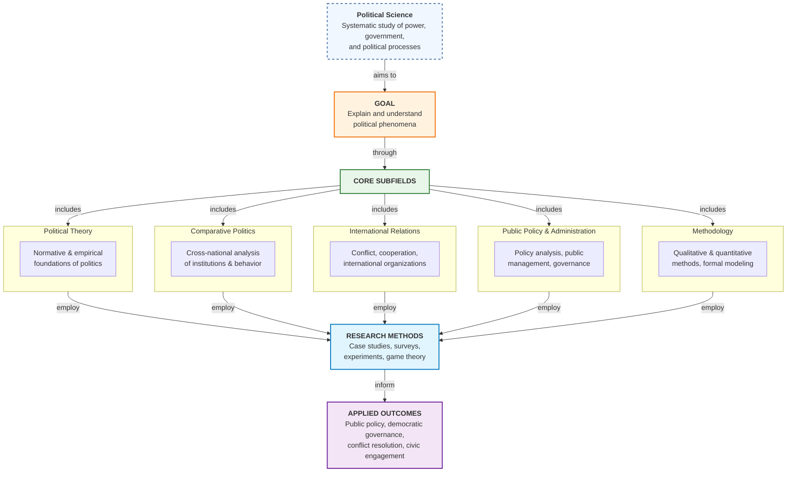

```mermaid
flowchart TD
    A[<b>Political Science</b><br>Systematic study of power, government,<br>and political processes]:::title
    B[<b>GOAL</b><br>Explain and understand<br>political phenomena]:::goal
    C[<b>CORE SUBFIELDS</b>]:::subfields
    subgraph D[Political Theory]
        D1[Normative & empirical<br>foundations of politics]
    end
    subgraph E[Comparative Politics]
        E1[Cross‑national analysis<br>of institutions & behavior]
    end
    subgraph F[International Relations]
        F1[Conflict, cooperation,<br>international organizations]
    end
    subgraph G[Public Policy & Administration]
        G1[Policy analysis, public<br>management, governance]
    end
    subgraph H[Methodology]
        H1[Qualitative & quantitative<br>methods, formal modeling]
    end
    I[<b>RESEARCH METHODS</b><br>Case studies, surveys,<br>experiments, game theory]:::methods
    J[<b>APPLIED OUTCOMES</b><br>Public policy, democratic governance,<br>conflict resolution, civic engagement]:::outcome

    A -->|aims to| B
    B -->|through| C
    C -->|includes| D
    C -->|includes| E
    C -->|includes| F
    C -->|includes| G
    C -->|includes| H
    D & E & F & G & H -->|employ| I
    I -->|inform| J

    classDef title fill:#f0f7ff,stroke:#4a6fa5,stroke-width:2px,color:#333,stroke-dasharray: 5 5
    classDef goal fill:#fff3e0,stroke:#ef6c00,stroke-width:2px,color:#333
    classDef subfields fill:#e8f5e9,stroke:#2e7d32,stroke-width:2px,color:#333
    classDef methods fill:#e1f5fe,stroke:#0277bd,stroke-width:2px,color:#333
    classDef outcome fill:#f3e5f5,stroke:#6a1b9a,stroke-width:2px,color:#333
```
