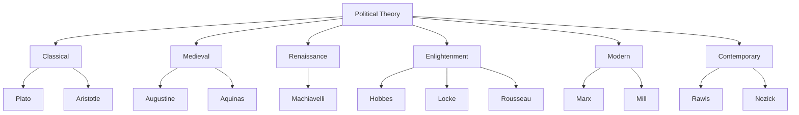

```mermaid
flowchart TD
    PT[Political Theory] --> CL[Classical]
    PT --> MED[Medieval]
    PT --> REN[Renaissance]
    PT --> ENL[Enlightenment]
    PT --> MOD[Modern]
    PT --> CONT[Contemporary]

    CL --> P[Plato]
    CL --> A[Aristotle]

    MED --> A2[Augustine]
    MED --> A3[Aquinas]

    REN --> M[Machiavelli]

    ENL --> H[Hobbes]
    ENL --> L[Locke]
    ENL --> R[Rousseau]

    MOD --> M2[Marx]
    MOD --> M3[Mill]

    CONT --> R2[Rawls]
    CONT --> N[Nozick]
```
