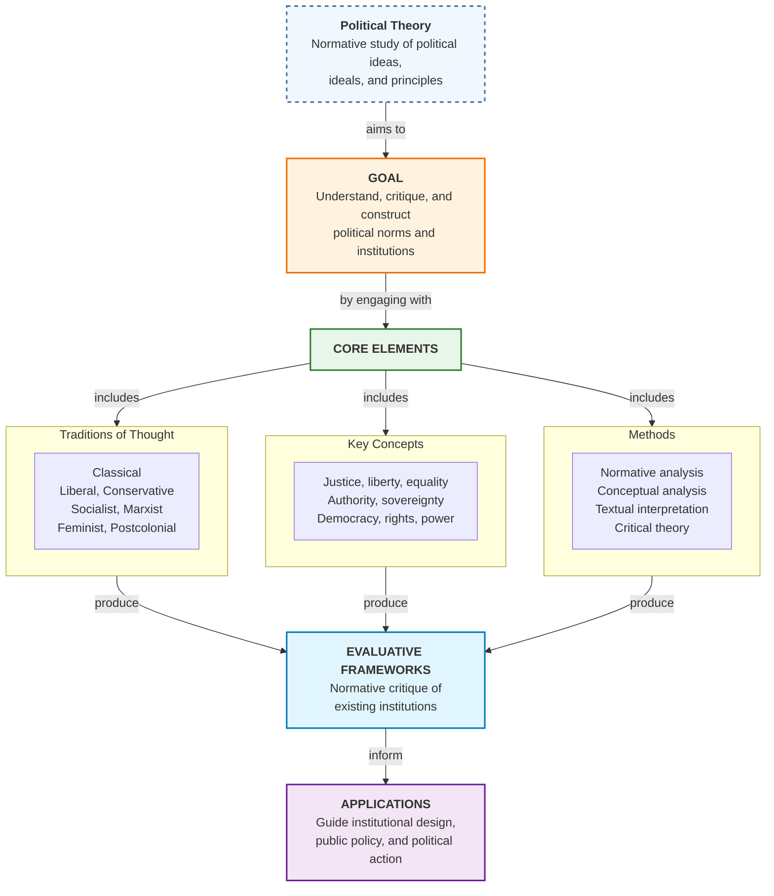

```mermaid
flowchart TD
    A[<b>Political Theory</b><br>Normative study of political ideas,<br>ideals, and principles]:::title
    B[<b>GOAL</b><br>Understand, critique, and construct<br>political norms and institutions]:::goal
    C[<b>CORE ELEMENTS</b>]:::elements
    subgraph D[Traditions of Thought]
        D1[Classical<br>Liberal, Conservative<br>Socialist, Marxist<br>Feminist, Postcolonial]
    end
    subgraph E[Key Concepts]
        E1[Justice, liberty, equality<br>Authority, sovereignty<br>Democracy, rights, power]
    end
    subgraph F[Methods]
        F1[Normative analysis<br>Conceptual analysis<br>Textual interpretation<br>Critical theory]
    end
    G[<b>EVALUATIVE FRAMEWORKS</b><br>Normative critique of<br>existing institutions]:::evaluation
    H[<b>APPLICATIONS</b><br>Guide institutional design,<br>public policy, and political action]:::outcome

    A -->|aims to| B
    B -->|by engaging with| C
    C -->|includes| D
    C -->|includes| E
    C -->|includes| F
    D & E & F -->|produce| G
    G -->|inform| H

    classDef title fill:#f0f7ff,stroke:#4a6fa5,stroke-width:2px,color:#333,stroke-dasharray: 5 5
    classDef goal fill:#fff3e0,stroke:#ef6c00,stroke-width:2px,color:#333
    classDef elements fill:#e8f5e9,stroke:#2e7d32,stroke-width:2px,color:#333
    classDef evaluation fill:#e1f5fe,stroke:#0277bd,stroke-width:2px,color:#333
    classDef outcome fill:#f3e5f5,stroke:#6a1b9a,stroke-width:2px,color:#333
```
