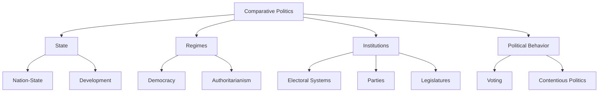

```mermaid
flowchart TD
    CP[Comparative Politics] --> S[State]
    CP --> R[Regimes]
    CP --> I[Institutions]
    CP --> PB[Political Behavior]

    S --> NAT[Nation-State]
    S --> DEV[Development]

    R --> DEM[Democracy]
    R --> AUTH[Authoritarianism]

    I --> E[Electoral Systems]
    I --> P[Parties]
    I --> L[Legislatures]

    PB --> V[Voting]
    PB --> C[Contentious Politics]
```
