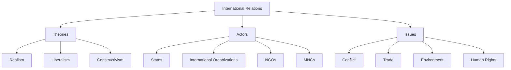

```mermaid
flowchart TD
    IR[International Relations] --> T[Theories]
    IR --> A[Actors]
    IR --> I[Issues]

    T --> R2[Realism]
    T --> L[Liberalism]
    T --> C[Constructivism]

    A --> S[States]
    A --> IO[International Organizations]
    A --> NGO[NGOs]
    A --> MNC[MNCs]

    I --> C2[Conflict]
    I --> T2[Trade]
    I --> E[Environment]
    I --> HR[Human Rights]
```
