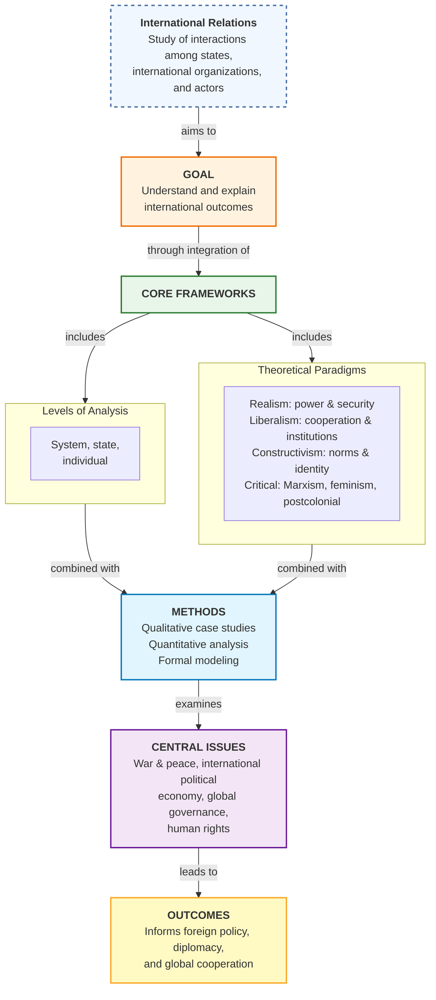

```mermaid
flowchart TD
    A[<b>International Relations</b><br>Study of interactions among states,<br>international organizations, and actors]:::title
    B[<b>GOAL</b><br>Understand and explain<br>international outcomes]:::goal
    C[<b>CORE FRAMEWORKS</b>]:::frameworks
    subgraph D[Levels of Analysis]
        D1[System, state,<br>individual]
    end
    subgraph E[Theoretical Paradigms]
        E1[Realism: power & security<br>Liberalism: cooperation & institutions<br>Constructivism: norms & identity<br>Critical: Marxism, feminism, postcolonial]
    end
    F[<b>METHODS</b><br>Qualitative case studies<br>Quantitative analysis<br>Formal modeling]:::methods
    G[<b>CENTRAL ISSUES</b><br>War & peace, international political<br>economy, global governance,<br>human rights]:::issues
    H[<b>OUTCOMES</b><br>Informs foreign policy, diplomacy,<br>and global cooperation]:::outcome

    A -->|aims to| B
    B -->|through integration of| C
    C -->|includes| D
    C -->|includes| E
    D & E -->|combined with| F
    F -->|examines| G
    G -->|leads to| H

    classDef title fill:#f0f7ff,stroke:#4a6fa5,stroke-width:2px,color:#333,stroke-dasharray: 5 5
    classDef goal fill:#fff3e0,stroke:#ef6c00,stroke-width:2px,color:#333
    classDef frameworks fill:#e8f5e9,stroke:#2e7d32,stroke-width:2px,color:#333
    classDef methods fill:#e1f5fe,stroke:#0277bd,stroke-width:2px,color:#333
    classDef issues fill:#f3e5f5,stroke:#6a1b9a,stroke-width:2px,color:#333
    classDef outcome fill:#fff9c4,stroke:#f9a825,stroke-width:2px,color:#333
```
