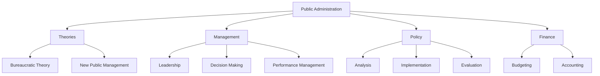

```mermaid
flowchart TD
    PA[Public Administration] --> T[Theories]
    PA --> M[Management]
    PA --> P[Policy]
    PA --> F[Finance]

    T --> B[Bureaucratic Theory]
    T --> NPM[New Public Management]

    M --> L[Leadership]
    M --> D[Decision Making]
    M --> PM[Performance Management]

    P --> A[Analysis]
    P --> I[Implementation]
    P --> E[Evaluation]

    F --> B2[Budgeting]
    F --> A2[Accounting]
```
