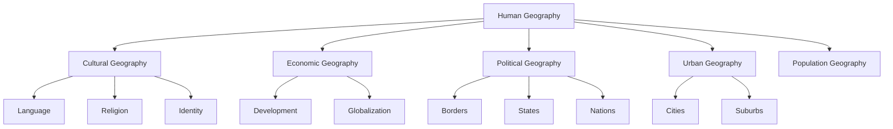

```mermaid
flowchart TD
    HG[Human Geography] --> C[Cultural Geography]
    HG --> E[Economic Geography]
    HG --> P[Political Geography]
    HG --> U[Urban Geography]
    HG --> POP[Population Geography]

    C --> L[Language]
    C --> R[Religion]
    C --> I[Identity]

    E --> D[Development]
    E --> G[Globalization]

    P --> B[Borders]
    P --> S[States]
    P --> N[Nations]

    U --> C2[Cities]
    U --> S2[Suburbs]
```
