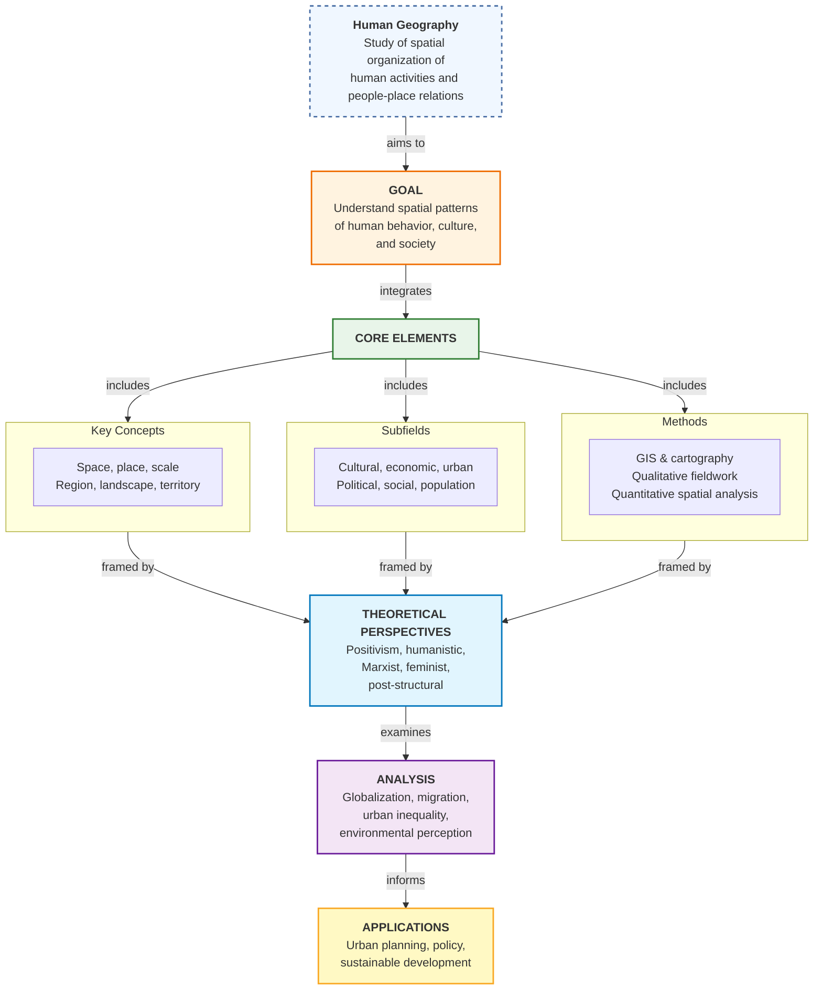

```mermaid
flowchart TD
    A[<b>Human Geography</b><br>Study of spatial organization of<br>human activities and people‑place relations]:::title
    B[<b>GOAL</b><br>Understand spatial patterns<br>of human behavior, culture,<br>and society]:::goal
    C[<b>CORE ELEMENTS</b>]:::elements
    subgraph D[Key Concepts]
        D1[Space, place, scale<br>Region, landscape, territory]
    end
    subgraph E[Subfields]
        E1[Cultural, economic, urban<br>Political, social, population]
    end
    subgraph F[Methods]
        F1[GIS & cartography<br>Qualitative fieldwork<br>Quantitative spatial analysis]
    end
    G[<b>THEORETICAL PERSPECTIVES</b><br>Positivism, humanistic,<br>Marxist, feminist,<br>post‑structural]:::theory
    H[<b>ANALYSIS</b><br>Globalization, migration,<br>urban inequality,<br>environmental perception]:::analysis
    I[<b>APPLICATIONS</b><br>Urban planning, policy,<br>sustainable development]:::outcome

    A -->|aims to| B
    B -->|integrates| C
    C -->|includes| D
    C -->|includes| E
    C -->|includes| F
    D & E & F -->|framed by| G
    G -->|examines| H
    H -->|informs| I

    classDef title fill:#f0f7ff,stroke:#4a6fa5,stroke-width:2px,color:#333,stroke-dasharray: 5 5
    classDef goal fill:#fff3e0,stroke:#ef6c00,stroke-width:2px,color:#333
    classDef elements fill:#e8f5e9,stroke:#2e7d32,stroke-width:2px,color:#333
    classDef theory fill:#e1f5fe,stroke:#0277bd,stroke-width:2px,color:#333
    classDef analysis fill:#f3e5f5,stroke:#6a1b9a,stroke-width:2px,color:#333
    classDef outcome fill:#fff9c4,stroke:#f9a825,stroke-width:2px,color:#333
```
