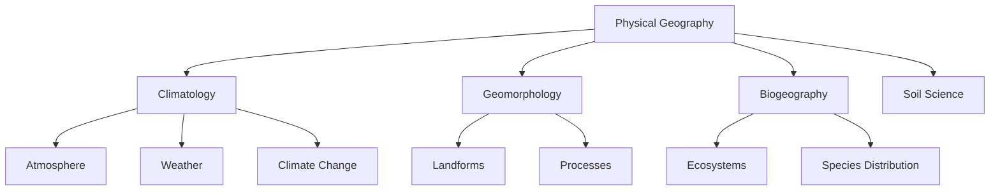

```mermaid
flowchart TD
    PG[Physical Geography] --> C[Climatology]
    PG --> G[Geomorphology]
    PG --> B[Biogeography]
    PG --> S[Soil Science]

    C --> A[Atmosphere]
    C --> W[Weather]
    C --> CC[Climate Change]

    G --> L[Landforms]
    G --> P[Processes]

    B --> E[Ecosystems]
    B --> S2[Species Distribution]
```
