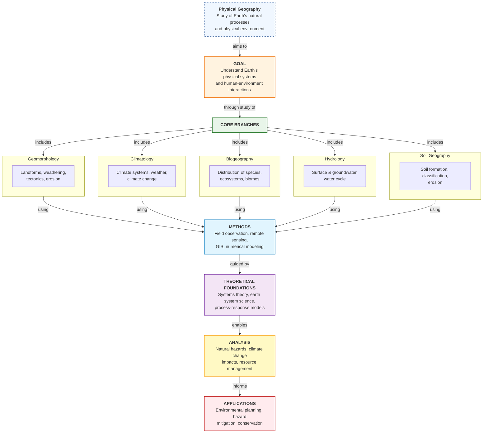

```mermaid
flowchart TD
    A[<b>Physical Geography</b><br>Study of Earth's natural processes<br>and physical environment]:::title
    B[<b>GOAL</b><br>Understand Earth's physical systems<br>and human‑environment interactions]:::goal
    C[<b>CORE BRANCHES</b>]:::branches
    subgraph D[Geomorphology]
        D1[Landforms, weathering,<br>tectonics, erosion]
    end
    subgraph E[Climatology]
        E1[Climate systems, weather,<br>climate change]
    end
    subgraph F[Biogeography]
        F1[Distribution of species,<br>ecosystems, biomes]
    end
    subgraph G[Hydrology]
        G1[Surface & groundwater,<br>water cycle]
    end
    subgraph H[Soil Geography]
        H1[Soil formation, classification,<br>erosion]
    end
    I[<b>METHODS</b><br>Field observation, remote sensing,<br>GIS, numerical modeling]:::methods
    J[<b>THEORETICAL FOUNDATIONS</b><br>Systems theory, earth system science,<br>process‑response models]:::theory
    K[<b>ANALYSIS</b><br>Natural hazards, climate change<br>impacts, resource management]:::analysis
    L[<b>APPLICATIONS</b><br>Environmental planning, hazard<br>mitigation, conservation]:::outcome

    A -->|aims to| B
    B -->|through study of| C
    C -->|includes| D
    C -->|includes| E
    C -->|includes| F
    C -->|includes| G
    C -->|includes| H
    D & E & F & G & H -->|using| I
    I -->|guided by| J
    J -->|enables| K
    K -->|informs| L

    classDef title fill:#f0f7ff,stroke:#4a6fa5,stroke-width:2px,color:#333,stroke-dasharray: 5 5
    classDef goal fill:#fff3e0,stroke:#ef6c00,stroke-width:2px,color:#333
    classDef branches fill:#e8f5e9,stroke:#2e7d32,stroke-width:2px,color:#333
    classDef methods fill:#e1f5fe,stroke:#0277bd,stroke-width:2px,color:#333
    classDef theory fill:#f3e5f5,stroke:#6a1b9a,stroke-width:2px,color:#333
    classDef analysis fill:#fff9c4,stroke:#f9a825,stroke-width:2px,color:#333
    classDef outcome fill:#ffebee,stroke:#c62828,stroke-width:2px,color:#333
```
