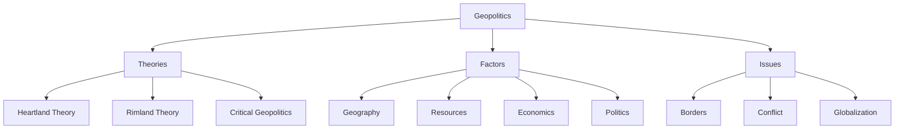

```mermaid
flowchart TD
    G[Geopolitics] --> T[Theories]
    G --> F[Factors]
    G --> I[Issues]

    T --> H[Heartland Theory]
    T --> R[Rimland Theory]
    T --> C[Critical Geopolitics]

    F --> G2[Geography]
    F --> R2[Resources]
    F --> E[Economics]
    F --> P[Politics]

    I --> B[Borders]
    I --> C2[Conflict]
    I --> G3[Globalization]
```
