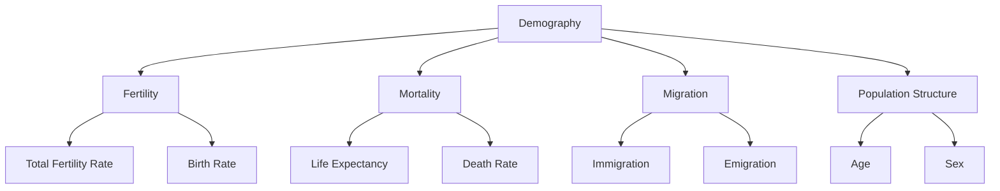

```mermaid
flowchart TD
    D[Demography] --> F[Fertility]
    D --> M[Mortality]
    D --> M2[Migration]
    D --> P[Population Structure]

    F --> TFR[Total Fertility Rate]
    F --> B[Birth Rate]

    M --> LE[Life Expectancy]
    M --> D2[Death Rate]

    M2 --> I[Immigration]
    M2 --> E[Emigration]

    P --> A[Age]
    P --> S[Sex]
```
