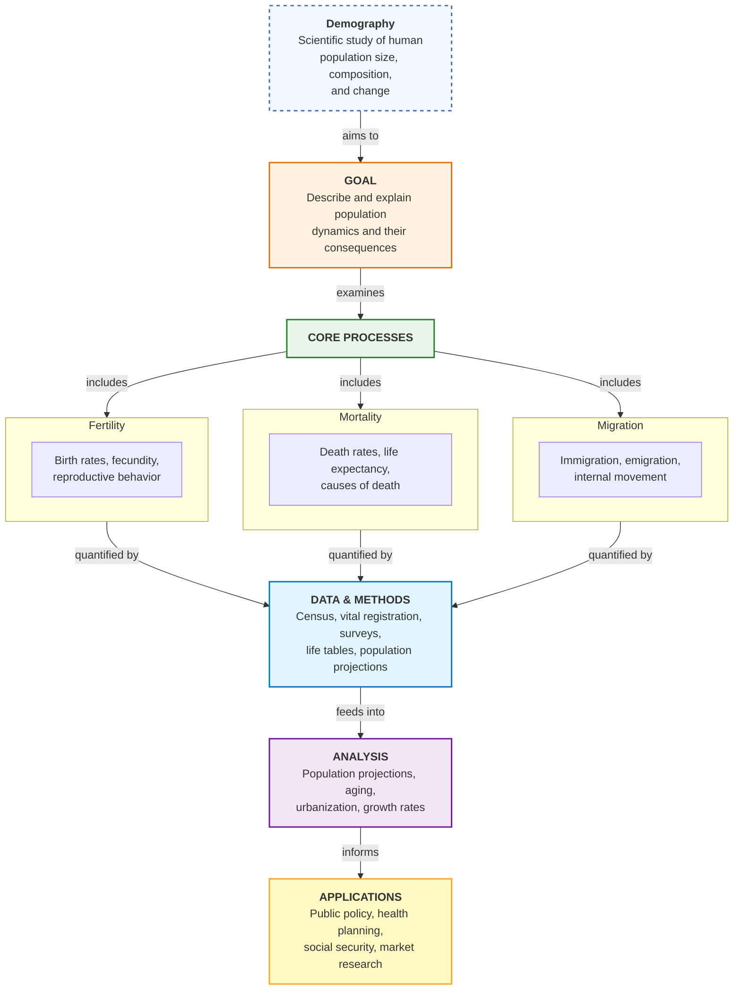

```mermaid
flowchart TD
    A[<b>Demography</b><br>Scientific study of human<br>population size, composition,<br>and change]:::title
    B[<b>GOAL</b><br>Describe and explain population<br>dynamics and their consequences]:::goal
    C[<b>CORE PROCESSES</b>]:::processes
    subgraph D[Fertility]
        D1[Birth rates, fecundity,<br>reproductive behavior]
    end
    subgraph E[Mortality]
        E1[Death rates, life expectancy,<br>causes of death]
    end
    subgraph F[Migration]
        F1[Immigration, emigration,<br>internal movement]
    end
    G[<b>DATA & METHODS</b><br>Census, vital registration, surveys,<br>life tables, population projections]:::methods
    H[<b>ANALYSIS</b><br>Population projections, aging,<br>urbanization, growth rates]:::analysis
    I[<b>APPLICATIONS</b><br>Public policy, health planning,<br>social security, market research]:::outcome

    A -->|aims to| B
    B -->|examines| C
    C -->|includes| D
    C -->|includes| E
    C -->|includes| F
    D & E & F -->|quantified by| G
    G -->|feeds into| H
    H -->|informs| I

    classDef title fill:#f0f7ff,stroke:#4a6fa5,stroke-width:2px,color:#333,stroke-dasharray: 5 5
    classDef goal fill:#fff3e0,stroke:#ef6c00,stroke-width:2px,color:#333
    classDef processes fill:#e8f5e9,stroke:#2e7d32,stroke-width:2px,color:#333
    classDef methods fill:#e1f5fe,stroke:#0277bd,stroke-width:2px,color:#333
    classDef analysis fill:#f3e5f5,stroke:#6a1b9a,stroke-width:2px,color:#333
    classDef outcome fill:#fff9c4,stroke:#f9a825,stroke-width:2px,color:#333
```
