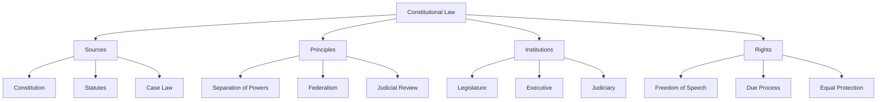

```mermaid
flowchart TD
    CL[Constitutional Law] --> S[Sources]
    CL --> P[Principles]
    CL --> I[Institutions]
    CL --> R[Rights]

    S --> C[Constitution]
    S --> S2[Statutes]
    S --> C2[Case Law]

    P --> SOP[Separation of Powers]
    P --> F[Federalism]
    P --> JR[Judicial Review]

    I --> L[Legislature]
    I --> E[Executive]
    I --> J[Judiciary]

    R --> FS[Freedom of Speech]
    R --> DP[Due Process]
    R --> EP[Equal Protection]
```
