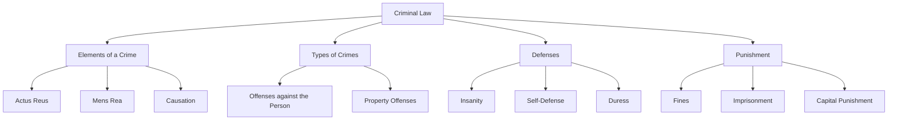

```mermaid
flowchart TD
    CL[Criminal Law] --> E[Elements of a Crime]
    CL --> T[Types of Crimes]
    CL --> D[Defenses]
    CL --> P[Punishment]

    E --> AR[Actus Reus]
    E --> MR[Mens Rea]
    E --> C[Causation]

    T --> O[Offenses against the Person]
    T --> P2[Property Offenses]

    D --> I[Insanity]
    D --> SD[Self-Defense]
    D --> D2[Duress]

    P --> F[Fines]
    P --> I2[Imprisonment]
    P --> CP[Capital Punishment]
```
