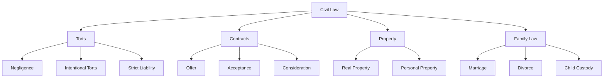

```mermaid
flowchart TD
    CL[Civil Law] --> T[Torts]
    CL --> C[Contracts]
    CL --> P[Property]
    CL --> F[Family Law]

    T --> N[Negligence]
    T --> I[Intentional Torts]
    T --> SL[Strict Liability]

    C --> O[Offer]
    C --> A[Acceptance]
    C --> C2[Consideration]

    P --> R[Real Property]
    P --> P2[Personal Property]

    F --> M[Marriage]
    F --> D[Divorce]
    F --> C3[Child Custody]
```
