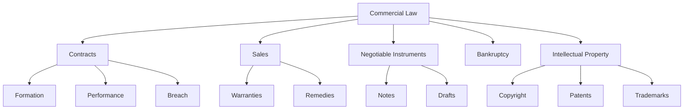

```mermaid
flowchart TD
    CL[Commercial Law] --> C[Contracts]
    CL --> S[Sales]
    CL --> NI[Negotiable Instruments]
    CL --> BA[Bankruptcy]
    CL --> IP[Intellectual Property]

    C --> F[Formation]
    C --> P[Performance]
    C --> B[Breach]

    S --> W[Warranties]
    S --> R[Remedies]

    NI --> N[Notes]
    NI --> D[Drafts]

    IP --> C2[Copyright]
    IP --> P2[Patents]
    IP --> T[Trademarks]
```
