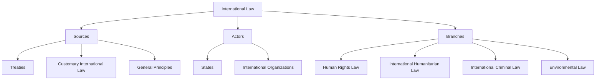

```mermaid
flowchart TD
    IL[International Law] --> S[Sources]
    IL --> A[Actors]
    IL --> B[Branches]

    S --> T[Treaties]
    S --> C[Customary International Law]
    S --> G[General Principles]

    A --> S2[States]
    A --> IO[International Organizations]

    B --> HRL[Human Rights Law]
    B --> IHL[International Humanitarian Law]
    B --> ICL[International Criminal Law]
    B --> EL[Environmental Law]
```
