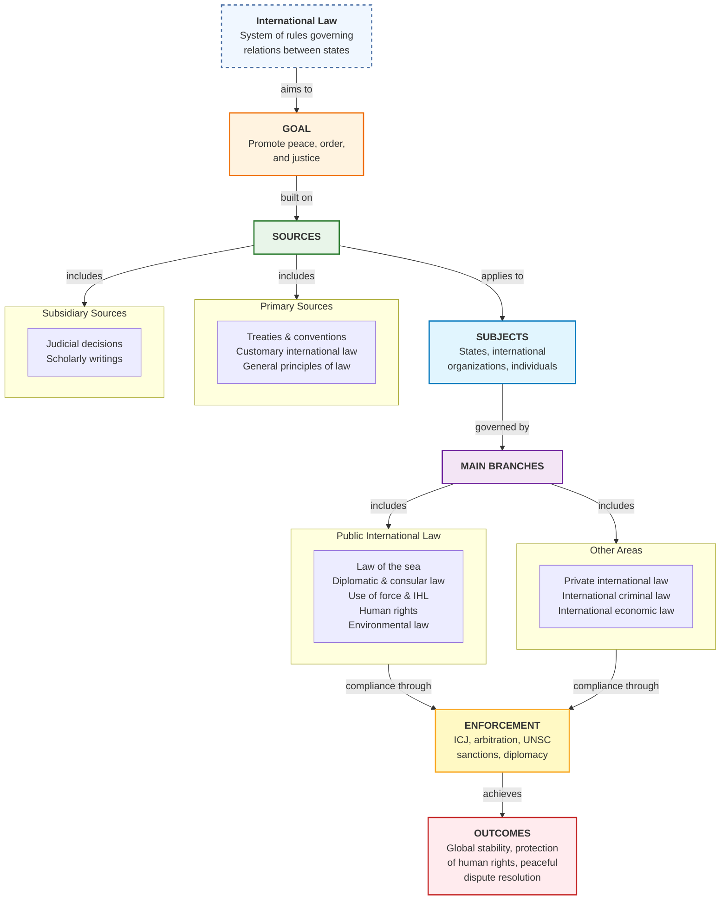

```mermaid
flowchart TD
    A[<b>International Law</b><br>System of rules governing<br>relations between states]:::title
    B[<b>GOAL</b><br>Promote peace, order,<br>and justice]:::goal
    C[<b>SOURCES</b>]:::sources
    subgraph D[Primary Sources]
        D1[Treaties & conventions<br>Customary international law<br>General principles of law]
    end
    subgraph E[Subsidiary Sources]
        E1[Judicial decisions<br>Scholarly writings]
    end
    F[<b>SUBJECTS</b><br>States, international<br>organizations, individuals]:::subjects
    G[<b>MAIN BRANCHES</b>]:::branches
    subgraph H[Public International Law]
        H1[Law of the sea<br>Diplomatic & consular law<br>Use of force & IHL<br>Human rights<br>Environmental law]
    end
    subgraph I[Other Areas]
        I1[Private international law<br>International criminal law<br>International economic law]
    end
    J[<b>ENFORCEMENT</b><br>ICJ, arbitration, UNSC<br>sanctions, diplomacy]:::enforcement
    K[<b>OUTCOMES</b><br>Global stability, protection<br>of human rights, peaceful<br>dispute resolution]:::outcome

    A -->|aims to| B
    B -->|built on| C
    C -->|includes| D
    C -->|includes| E
    C -->|applies to| F
    F -->|governed by| G
    G -->|includes| H
    G -->|includes| I
    H & I -->|compliance through| J
    J -->|achieves| K

    classDef title fill:#f0f7ff,stroke:#4a6fa5,stroke-width:2px,color:#333,stroke-dasharray: 5 5
    classDef goal fill:#fff3e0,stroke:#ef6c00,stroke-width:2px,color:#333
    classDef sources fill:#e8f5e9,stroke:#2e7d32,stroke-width:2px,color:#333
    classDef subjects fill:#e1f5fe,stroke:#0277bd,stroke-width:2px,color:#333
    classDef branches fill:#f3e5f5,stroke:#6a1b9a,stroke-width:2px,color:#333
    classDef enforcement fill:#fff9c4,stroke:#f9a825,stroke-width:2px,color:#333
    classDef outcome fill:#ffebee,stroke:#c62828,stroke-width:2px,color:#333
```
