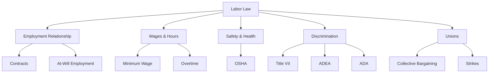

```mermaid
flowchart TD
    LL[Labor Law] --> ER[Employment Relationship]
    LL --> W[Wages & Hours]
    LL --> S[Safety & Health]
    LL --> D[Discrimination]
    LL --> U[Unions]

    ER --> C[Contracts]
    ER --> AT[At-Will Employment]

    W --> MW[Minimum Wage]
    W --> O[Overtime]

    S --> OSHA[OSHA]

    D --> T7[Title VII]
    D --> ADEA[ADEA]
    D --> ADA[ADA]

    U --> CB[Collective Bargaining]
    U --> S2[Strikes]
```
