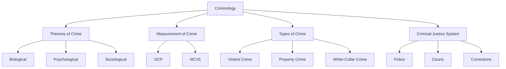

```mermaid
flowchart TD
    C[Criminology] --> T[Theories of Crime]
    C --> M[Measurement of Crime]
    C --> T2[Types of Crime]
    C --> CJ[Criminal Justice System]

    T --> B[Biological]
    T --> P[Psychological]
    T --> S[Sociological]

    M --> UCR[UCR]
    M --> NCVS[NCVS]

    T2 --> V[Violent Crime]
    T2 --> P2[Property Crime]
    T2 --> WC[White-Collar Crime]

    CJ --> P3[Police]
    CJ --> C2[Courts]
    CJ --> C3[Corrections]
```
