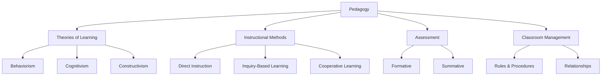

```mermaid
flowchart TD
    P[Pedagogy] --> T[Theories of Learning]
    P --> IM[Instructional Methods]
    P --> A[Assessment]
    P --> CM[Classroom Management]

    T --> B[Behaviorism]
    T --> C[Cognitivism]
    T --> C2[Constructivism]

    IM --> D[Direct Instruction]
    IM --> I[Inquiry-Based Learning]
    IM --> C3[Cooperative Learning]

    A --> F[Formative]
    A --> S[Summative]

    CM --> R[Rules & Procedures]
    CM --> R2[Relationships]
```
