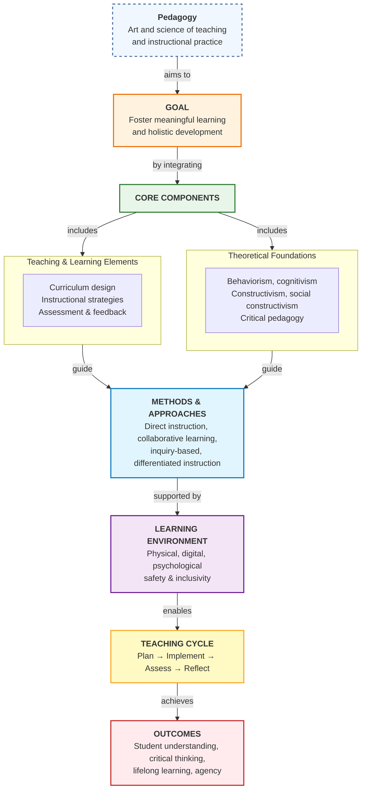

```mermaid
flowchart TD
    A[<b>Pedagogy</b><br>Art and science of teaching<br>and instructional practice]:::title
    B[<b>GOAL</b><br>Foster meaningful learning<br>and holistic development]:::goal
    C[<b>CORE COMPONENTS</b>]:::components
    subgraph D[Teaching & Learning Elements]
        D1[Curriculum design<br>Instructional strategies<br>Assessment & feedback]
    end
    subgraph E[Theoretical Foundations]
        E1[Behaviorism, cognitivism<br>Constructivism, social constructivism<br>Critical pedagogy]
    end
    F[<b>METHODS & APPROACHES</b><br>Direct instruction, collaborative learning,<br>inquiry‑based, differentiated instruction]:::methods
    G[<b>LEARNING ENVIRONMENT</b><br>Physical, digital, psychological<br>safety & inclusivity]:::environment
    H[<b>TEACHING CYCLE</b><br>Plan → Implement → Assess → Reflect]:::cycle
    I[<b>OUTCOMES</b><br>Student understanding, critical thinking,<br>lifelong learning, agency]:::outcome

    A -->|aims to| B
    B -->|by integrating| C
    C -->|includes| D
    C -->|includes| E
    D & E -->|guide| F
    F -->|supported by| G
    G -->|enables| H
    H -->|achieves| I

    classDef title fill:#f0f7ff,stroke:#4a6fa5,stroke-width:2px,color:#333,stroke-dasharray: 5 5
    classDef goal fill:#fff3e0,stroke:#ef6c00,stroke-width:2px,color:#333
    classDef components fill:#e8f5e9,stroke:#2e7d32,stroke-width:2px,color:#333
    classDef methods fill:#e1f5fe,stroke:#0277bd,stroke-width:2px,color:#333
    classDef environment fill:#f3e5f5,stroke:#6a1b9a,stroke-width:2px,color:#333
    classDef cycle fill:#fff9c4,stroke:#f9a825,stroke-width:2px,color:#333
    classDef outcome fill:#ffebee,stroke:#c62828,stroke-width:2px,color:#333
```
