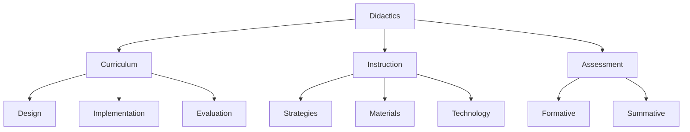

```mermaid
flowchart TD
    D[Didactics] --> C[Curriculum]
    D --> I[Instruction]
    D --> A[Assessment]

    C --> D2[Design]
    C --> I2[Implementation]
    C --> E[Evaluation]

    I --> S[Strategies]
    I --> M[Materials]
    I --> T[Technology]

    A --> F[Formative]
    A --> S2[Summative]
```
