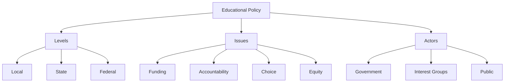

```mermaid
flowchart TD
    EP[Educational Policy] --> L[Levels]
    EP --> I[Issues]
    EP --> A[Actors]

    L --> L2[Local]
    L --> S[State]
    L --> F[Federal]

    I --> F2[Funding]
    I --> A2[Accountability]
    I --> C[Choice]
    I --> E[Equity]

    A --> G[Government]
    A --> IG[Interest Groups]
    A --> P[Public]
```
