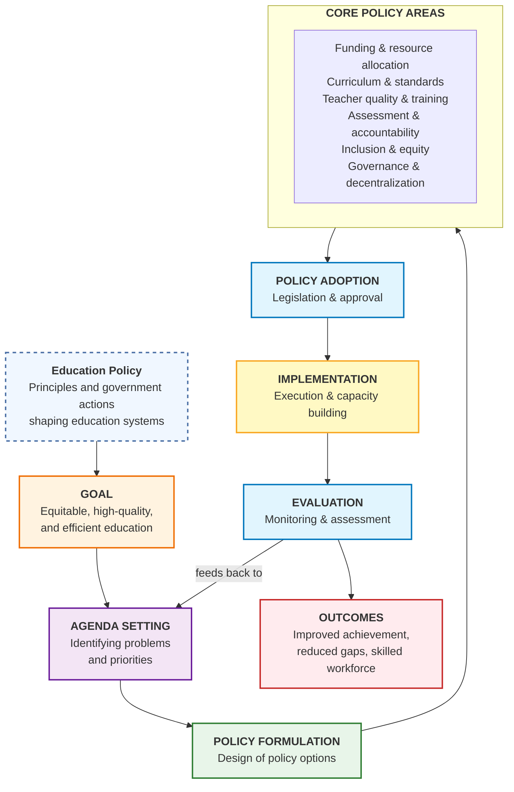

```mermaid
flowchart TD
    A[<b>Education Policy</b><br>Principles and government actions<br>shaping education systems]:::title
    B[<b>GOAL</b><br>Equitable, high‑quality,<br>and efficient education]:::goal
    C[<b>AGENDA SETTING</b><br>Identifying problems<br>and priorities]:::agenda
    D[<b>POLICY FORMULATION</b><br>Design of policy options]:::formulation
    subgraph E[<b>CORE POLICY AREAS</b>]
        E1[Funding & resource allocation<br>Curriculum & standards<br>Teacher quality & training<br>Assessment & accountability<br>Inclusion & equity<br>Governance & decentralization]
    end
    F[<b>POLICY ADOPTION</b><br>Legislation & approval]:::adoption
    G[<b>IMPLEMENTATION</b><br>Execution & capacity building]:::implementation
    H[<b>EVALUATION</b><br>Monitoring & assessment]:::evaluation
    I[<b>OUTCOMES</b><br>Improved achievement,<br>reduced gaps, skilled workforce]:::outcome

    A --> B --> C --> D
    D --> E
    E --> F --> G --> H
    H -->|feeds back to| C
    H --> I

    classDef title fill:#f0f7ff,stroke:#4a6fa5,stroke-width:2px,color:#333,stroke-dasharray: 5 5
    classDef goal fill:#fff3e0,stroke:#ef6c00,stroke-width:2px,color:#333
    classDef agenda fill:#f3e5f5,stroke:#6a1b9a,stroke-width:2px,color:#333
    classDef formulation fill:#e8f5e9,stroke:#2e7d32,stroke-width:2px,color:#333
    classDef adoption fill:#e1f5fe,stroke:#0277bd,stroke-width:2px,color:#333
    classDef implementation fill:#fff9c4,stroke:#f9a825,stroke-width:2px,color:#333
    classDef evaluation fill:#e1f5fe,stroke:#0277bd,stroke-width:2px,color:#333
    classDef outcome fill:#ffebee,stroke:#c62828,stroke-width:2px,color:#333
```
