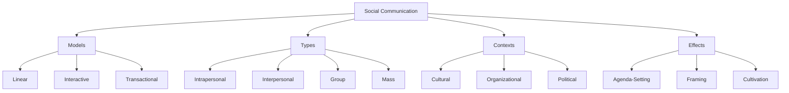

```mermaid
flowchart TD
    SC[Social Communication] --> M[Models]
    SC --> T[Types]
    SC --> C[Contexts]
    SC --> E[Effects]

    M --> L[Linear]
    M --> I[Interactive]
    M --> T2[Transactional]

    T --> IV[Intrapersonal]
    T --> IP[Interpersonal]
    T --> G[Group]
    T --> M2[Mass]

    C --> C2[Cultural]
    C --> O[Organizational]
    C --> P2[Political]

    E --> A[Agenda-Setting]
    E --> F[Framing]
    E --> C3[Cultivation]
```
