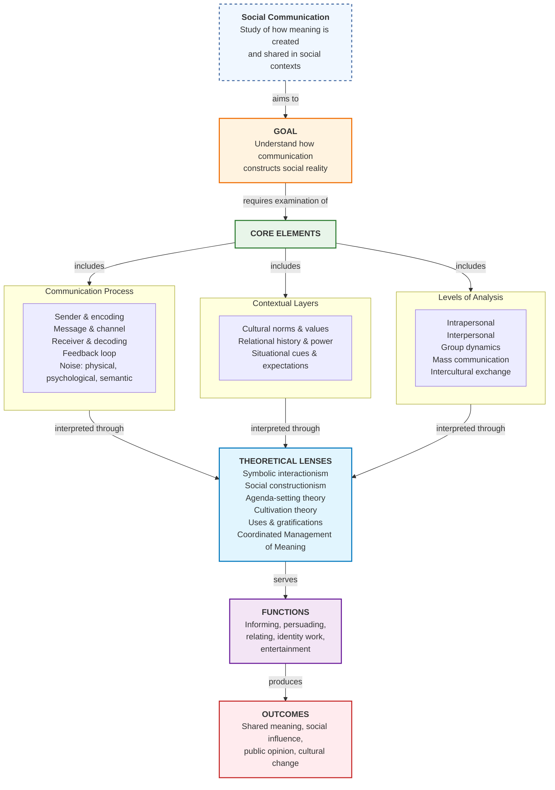

```mermaid
flowchart TD
    A[<b>Social Communication</b><br>Study of how meaning is created<br>and shared in social contexts]:::titulo
    B[<b>GOAL</b><br>Understand how communication<br>constructs social reality]:::goal
    C[<b>CORE ELEMENTS</b>]:::elements
    subgraph D[Communication Process]
        D1[Sender & encoding<br>Message & channel<br>Receiver & decoding<br>Feedback loop<br>Noise: physical, psychological, semantic]
    end
    subgraph E[Contextual Layers]
        E1[Cultural norms & values<br>Relational history & power<br>Situational cues & expectations]
    end
    subgraph F[Levels of Analysis]
        F1[Intrapersonal<br>Interpersonal<br>Group dynamics<br>Mass communication<br>Intercultural exchange]
    end
    G[<b>THEORETICAL LENSES</b><br>Symbolic interactionism<br>Social constructionism<br>Agenda‑setting theory<br>Cultivation theory<br>Uses & gratifications<br>Coordinated Management of Meaning]:::theory
    H[<b>FUNCTIONS</b><br>Informing, persuading,<br>relating, identity work,<br>entertainment]:::functions
    I[<b>OUTCOMES</b><br>Shared meaning, social influence,<br>public opinion, cultural change]:::outcome

    A -->|aims to| B
    B -->|requires examination of| C
    C -->|includes| D
    C -->|includes| E
    C -->|includes| F
    D & E & F -->|interpreted through| G
    G -->|serves| H
    H -->|produces| I

    classDef titulo fill:#f0f7ff,stroke:#4a6fa5,stroke-width:2px,color:#333,stroke-dasharray: 5 5
    classDef goal fill:#fff3e0,stroke:#ef6c00,stroke-width:2px,color:#333
    classDef elements fill:#e8f5e9,stroke:#2e7d32,stroke-width:2px,color:#333
    classDef theory fill:#e1f5fe,stroke:#0277bd,stroke-width:2px,color:#333
    classDef functions fill:#f3e5f5,stroke:#6a1b9a,stroke-width:2px,color:#333
    classDef outcome fill:#ffebee,stroke:#c62828,stroke-width:2px,color:#333
```
