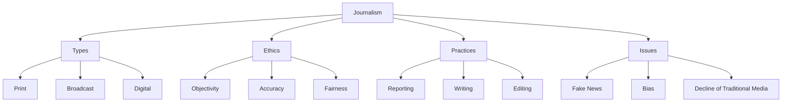

```mermaid
flowchart TD
    J[Journalism] --> T[Types]
    J --> E[Ethics]
    J --> P[Practices]
    J --> I[Issues]

    T --> P2[Print]
    T --> B[Broadcast]
    T --> D[Digital]

    E --> O[Objectivity]
    E --> A[Accuracy]
    E --> F[Fairness]

    P --> R[Reporting]
    P --> W[Writing]
    P --> E2[Editing]

    I --> FN[Fake News]
    I --> BI[Bias]
    I --> D2[Decline of Traditional Media]
```
