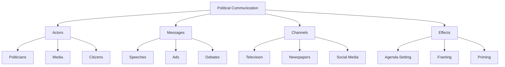

```mermaid
flowchart TD
    PC[Political Communication] --> A[Actors]
    PC --> M[Messages]
    PC --> C[Channels]
    PC --> E[Effects]

    A --> P[Politicians]
    A --> M2[Media]
    A --> C2[Citizens]

    M --> S[Speeches]
    M --> A2[Ads]
    M --> D[Debates]

    C --> TV[Television]
    C --> NP[Newspapers]
    C --> SM[Social Media]

    E --> AS[Agenda-Setting]
    E --> F[Framing]
    E --> P2[Priming]
```
