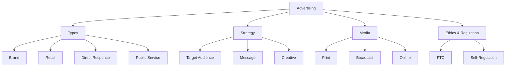

```mermaid
flowchart TD
    A[Advertising] --> T[Types]
    A --> S[Strategy]
    A --> M[Media]
    A --> E[Ethics & Regulation]

    T --> B[Brand]
    T --> R[Retail]
    T --> D[Direct Response]
    T --> P[Public Service]

    S --> T2[Target Audience]
    S --> M2[Message]
    S --> C[Creative]

    M --> P2[Print]
    M --> B2[Broadcast]
    M --> O[Online]

    E --> FTC[FTC]
    E --> S2[Self-Regulation]
```
