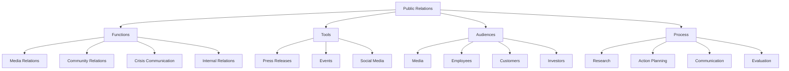

```mermaid
flowchart TD
    PR[Public Relations] --> F[Functions]
    PR --> T[Tools]
    PR --> A[Audiences]
    PR --> P[Process]

    F --> MR[Media Relations]
    F --> CR[Community Relations]
    F --> C[Crisis Communication]
    F --> IR[Internal Relations]

    T --> PR2[Press Releases]
    T --> E[Events]
    T --> SM[Social Media]

    A --> M[Media]
    A --> E2[Employees]
    A --> C2[Customers]
    A --> I[Investors]

    P --> R[Research]
    P --> A2[Action Planning]
    P --> C3[Communication]
    P --> E3[Evaluation]
```
