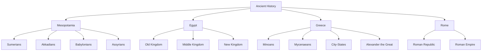

```mermaid
flowchart TD
    AH[Ancient History] --> ME[Mesopotamia]
    AH --> E[Egypt]
    AH --> G[Greece]
    AH --> R[Rome]

    ME --> S[Sumerians]
    ME --> A[Akkadians]
    ME --> B[Babylonians]
    ME --> A2[Assyrians]

    E --> OK[Old Kingdom]
    E --> MK[Middle Kingdom]
    E --> NK[New Kingdom]

    G --> M[Minoans]
    G --> M2[Mycenaeans]
    G --> C[City-States]
    G --> A3[Alexander the Great]

    R --> R2[Roman Republic]
    R --> R3[Roman Empire]
```
