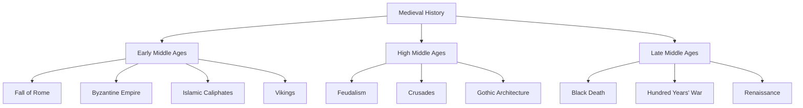

```mermaid
flowchart TD
    MH[Medieval History] --> EM[Early Middle Ages]
    MH --> HM[High Middle Ages]
    MH --> LM[Late Middle Ages]

    EM --> FR[Fall of Rome]
    EM --> B[Byzantine Empire]
    EM --> I[Islamic Caliphates]
    EM --> V[Vikings]

    HM --> F[Feudalism]
    HM --> C[Crusades]
    HM --> G[Gothic Architecture]

    LM --> BD[Black Death]
    LM --> HYW[Hundred Years' War]
    LM --> R[Renaissance]
```
