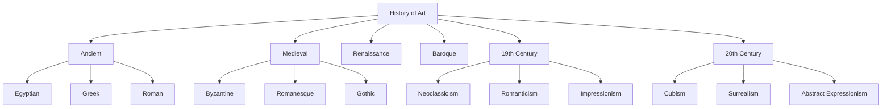

```mermaid
flowchart TD
    HA[History of Art] --> A[Ancient]
    HA --> M[Medieval]
    HA --> R[Renaissance]
    HA --> B[Baroque]
    HA --> N[19th Century]
    HA --> T[20th Century]

    A --> E[Egyptian]
    A --> G[Greek]
    A --> R2[Roman]

    M --> B2[Byzantine]
    M --> R3[Romanesque]
    M --> G2[Gothic]

    N --> NC[Neoclassicism]
    N --> R4[Romanticism]
    N --> I[Impressionism]

    T --> C[Cubism]
    T --> S[Surrealism]
    T --> A2[Abstract Expressionism]
```
