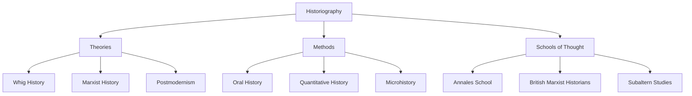

```mermaid
flowchart TD
    H[Historiography] --> T[Theories]
    H --> M[Methods]
    H --> S[Schools of Thought]

    T --> WH[Whig History]
    T --> M2[Marxist History]
    T --> P[Postmodernism]

    M --> OS[Oral History]
    M --> Q[Quantitative History]
    M --> M3[Microhistory]

    S --> A[Annales School]
    S --> B[British Marxist Historians]
    S --> S2[Subaltern Studies]
```
