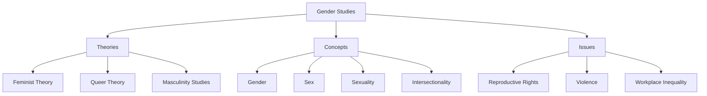

```mermaid
flowchart TD
    GS[Gender Studies] --> T[Theories]
    GS --> C[Concepts]
    GS --> I[Issues]

    T --> FT[Feminist Theory]
    T --> QT[Queer Theory]
    T --> MT[Masculinity Studies]

    C --> G[Gender]
    C --> S[Sex]
    C --> S2[Sexuality]
    C --> I2[Intersectionality]

    I --> R[Reproductive Rights]
    I --> V[Violence]
    I --> W[Workplace Inequality]
```
