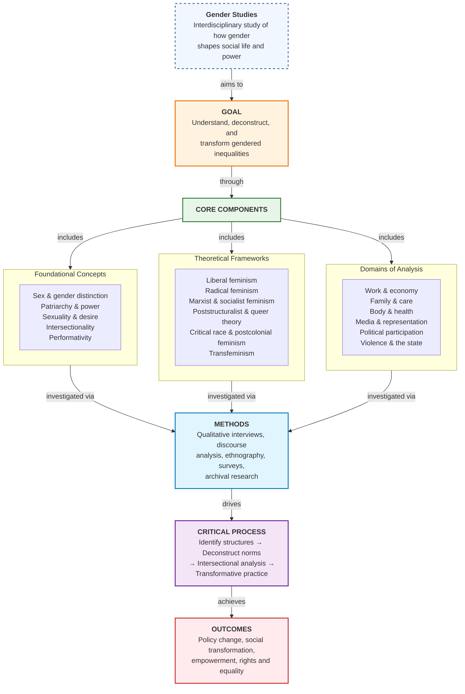

```mermaid
flowchart TD
    A[<b>Gender Studies</b><br>Interdisciplinary study of how gender<br>shapes social life and power]:::title
    B[<b>GOAL</b><br>Understand, deconstruct, and<br>transform gendered inequalities]:::goal
    C[<b>CORE COMPONENTS</b>]:::core
    subgraph D[Foundational Concepts]
        D1[Sex & gender distinction<br>Patriarchy & power<br>Sexuality & desire<br>Intersectionality<br>Performativity]
    end
    subgraph E[Theoretical Frameworks]
        E1[Liberal feminism<br>Radical feminism<br>Marxist & socialist feminism<br>Poststructuralist & queer theory<br>Critical race & postcolonial feminism<br>Transfeminism]
    end
    subgraph F[Domains of Analysis]
        F1[Work & economy<br>Family & care<br>Body & health<br>Media & representation<br>Political participation<br>Violence & the state]
    end
    G[<b>METHODS</b><br>Qualitative interviews, discourse<br>analysis, ethnography, surveys,<br>archival research]:::methods
    H[<b>CRITICAL PROCESS</b><br>Identify structures → Deconstruct norms<br>→ Intersectional analysis →<br>Transformative practice]:::process
    I[<b>OUTCOMES</b><br>Policy change, social transformation,<br>empowerment, rights and equality]:::outcome

    A -->|aims to| B
    B -->|through| C
    C -->|includes| D
    C -->|includes| E
    C -->|includes| F
    D & E & F -->|investigated via| G
    G -->|drives| H
    H -->|achieves| I

    classDef title fill:#f0f7ff,stroke:#4a6fa5,stroke-width:2px,color:#333,stroke-dasharray: 5 5
    classDef goal fill:#fff3e0,stroke:#ef6c00,stroke-width:2px,color:#333
    classDef core fill:#e8f5e9,stroke:#2e7d32,stroke-width:2px,color:#333
    classDef methods fill:#e1f5fe,stroke:#0277bd,stroke-width:2px,color:#333
    classDef process fill:#f3e5f5,stroke:#6a1b9a,stroke-width:2px,color:#333
    classDef outcome fill:#ffebee,stroke:#c62828,stroke-width:2px,color:#333
```
