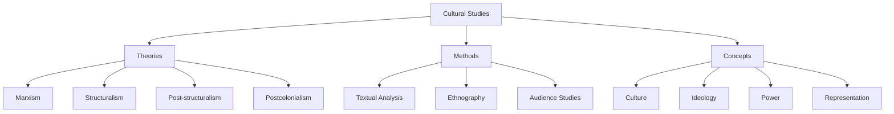

```mermaid
flowchart TD
    CS[Cultural Studies] --> T[Theories]
    CS --> M[Methods]
    CS --> C[Concepts]

    T --> M2[Marxism]
    T --> S[Structuralism]
    T --> P[Post-structuralism]
    T --> P2[Postcolonialism]

    M --> T2[Textual Analysis]
    M --> E[Ethnography]
    M --> A[Audience Studies]

    C --> C2[Culture]
    C --> I[Ideology]
    C --> P3[Power]
    C --> R[Representation]
```
