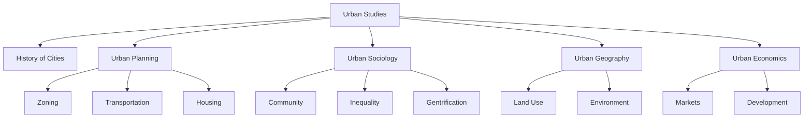

```mermaid
flowchart TD
    US[Urban Studies] --> H[History of Cities]
    US --> P[Urban Planning]
    US --> S[Urban Sociology]
    US --> G[Urban Geography]
    US --> E[Urban Economics]

    P --> Z[Zoning]
    P --> T[Transportation]
    P --> H2[Housing]

    S --> C[Community]
    S --> I[Inequality]
    S --> G2[Gentrification]

    G --> L[Land Use]
    G --> E2[Environment]

    E --> M[Markets]
    E --> D[Development]
```
