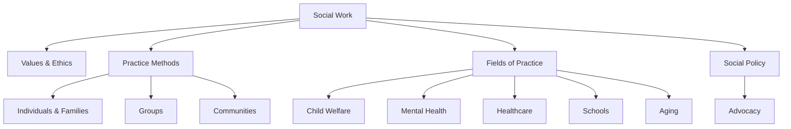

```mermaid
flowchart TD
    SW[Social Work] --> V[Values & Ethics]
    SW --> P[Practice Methods]
    SW --> F[Fields of Practice]
    SW --> S[Social Policy]

    P --> I[Individuals & Families]
    P --> G[Groups]
    P --> C[Communities]

    F --> C2[Child Welfare]
    F --> MH[Mental Health]
    F --> H[Healthcare]
    F --> S2[Schools]
    F --> A[Aging]

    S --> A2[Advocacy]
```
